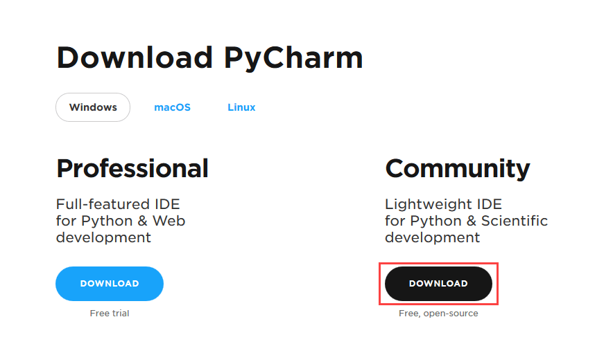
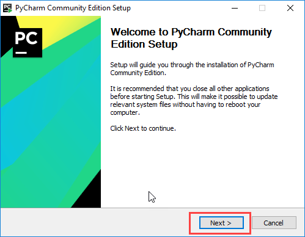
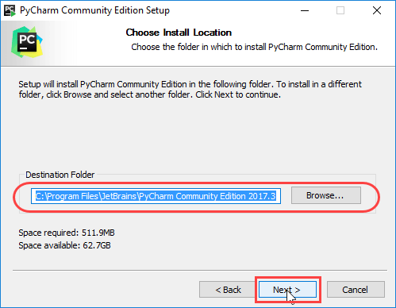
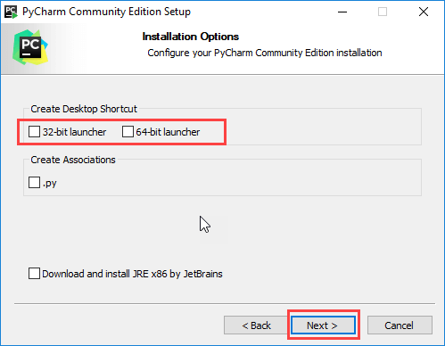
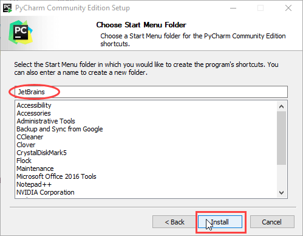
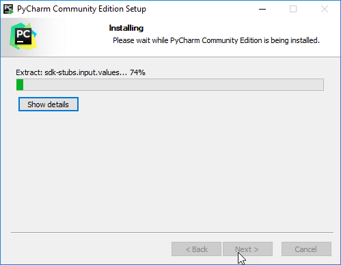
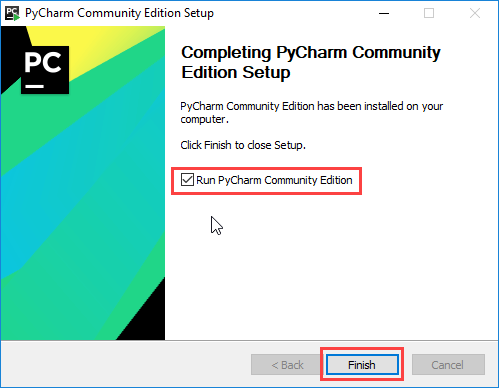

### 1.Installation for Windows
#### Go here and download [Pycharm IDE Community Version](https://www.jetbrains.com/pycharm/download/#section=windows)
  

#### 2.After downloading the installer, run it.

#### 3.Now click **Next** to proceed
  

#### 4.Now click **Next** to proceed
  

#### 5.Now select 64-bit launcher and click on Next
  

#### 6.Now Click on Install
  

#### 7.Wait for the complete installation
  

#### 8.Now select Pycharm community edition and Click Finish
  
