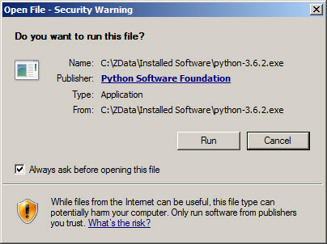
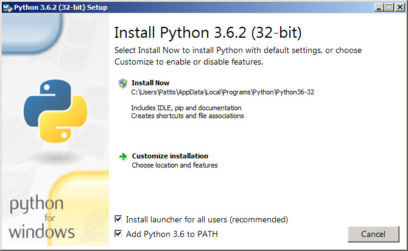
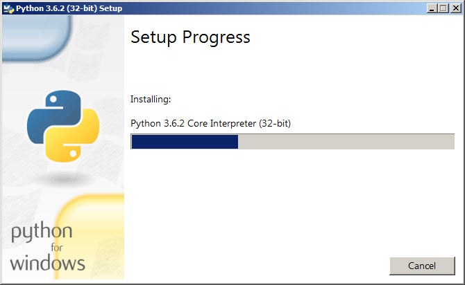
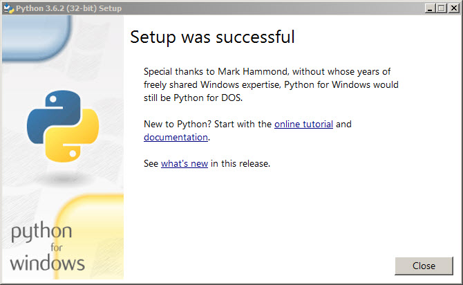

### Installing Python v3
- **For Linux user,**
  - No installation required
- **For Windows user,**
  - Download it from here [Python 3](https://ww.python.org/downloads/)
    - ### Step 01
    
    

    - ### Step 02

    

    - ### Step 03

    

    - ### Step 04

    
